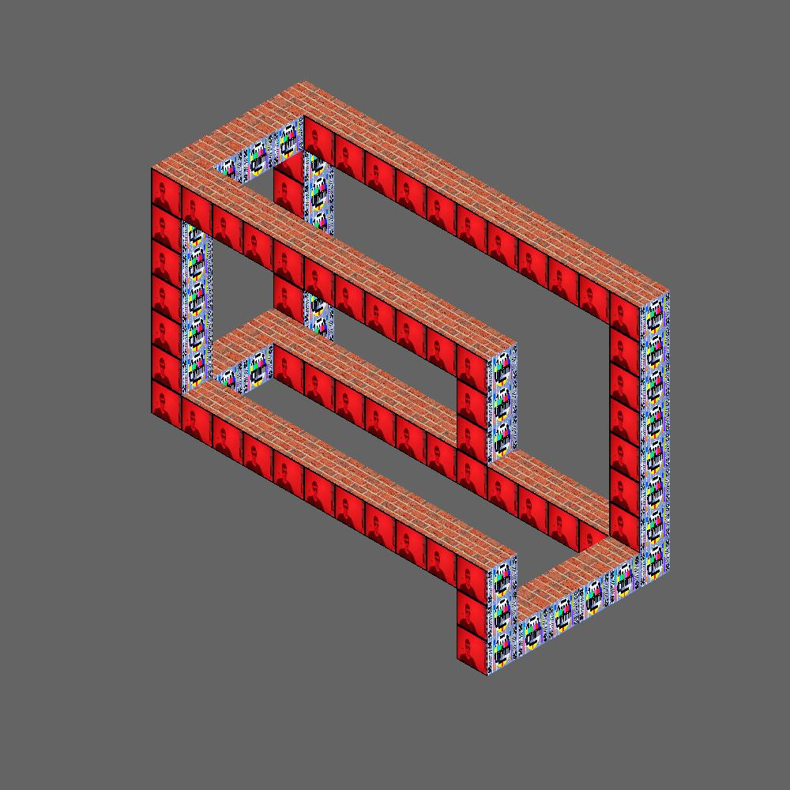
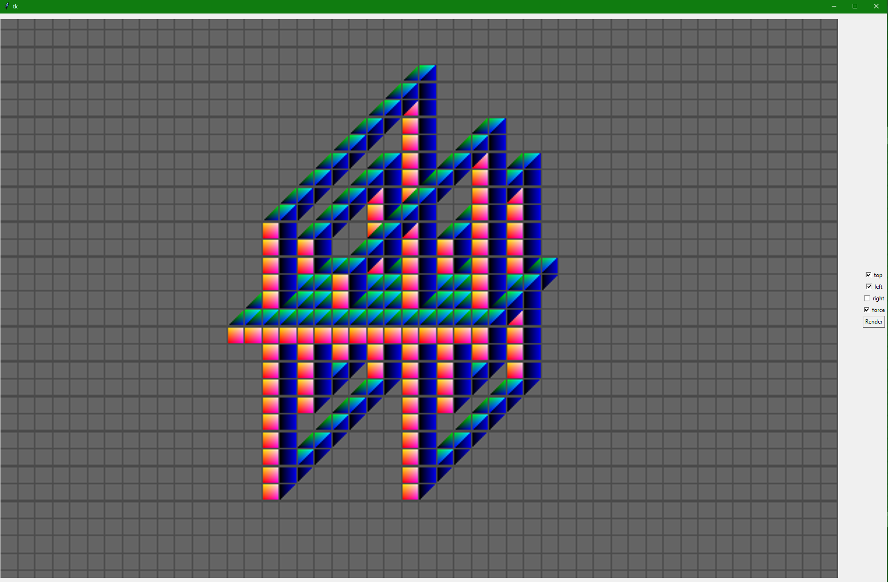

# impossibleFigure

Currently a work in progress

Renders three grids of parallelograms to make an impossible figure.

Renders each pixel independently in a single pass

Some more early test renders

And a look at the interface, what's important is that the perspective angles of each cuboid in the interface when designing the figure can be different from when rendering the figure

Todo

-add way to easily change shape that is rendered

-add  way to change textures through interface