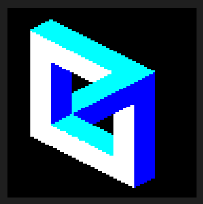

# impossibleFigure

Currently a work in progress

Renders three grids of parallelograms to make an impossible figure.

Renders each pixel independently in a single pass

Todo
-add way to easily change shape that is rendered
-add textures